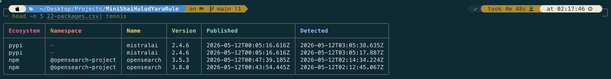
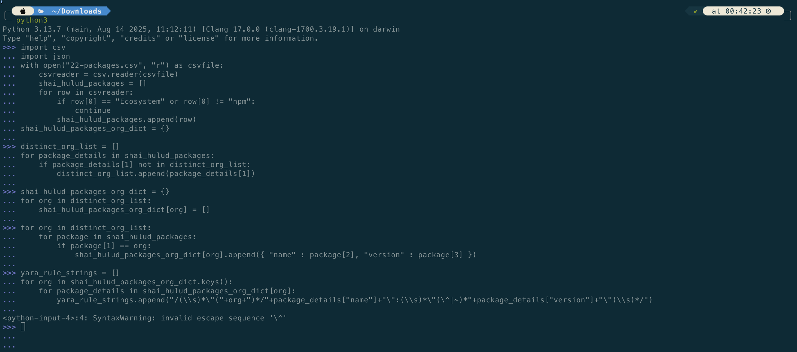

# Mini Shai Hulud YARA Rule 


This repo is for the yara rules that I am writing, for helping detect the `npm` packages affected by the **Mini Shai Hulud** Supply Chain attack ( duration 29th April 2026 to 12th May 2026 ) that list the compromised packages in their `package.json`. The threat actor identified is **TeamPCP**.

The total number of packages impacted in the `npm` ecosystem is 409. 

## Repo Structure and Implementation Details
        ```
        .
        ├── Images
        │   ├── 22-packages-csv-structure.png
        │   └── python3_REPL_code.png
        ├── LICENSE
        ├── mini_shai_hulud_yara_rule_dependencies.yar
        ├── python3_REPL_code.png
        ├── README.md
        └── yara_strings_variables.py
        ```
## Data Source

This `CSV` can be found in the socket.dev link provided in the References section of this README. 

`head -n 5 22-packages.csv | tennis`



### Preparing the YARA Rule

The package details for the npm ecosystem were parsed and extracted from the csv, as shown in the below image, on the python3 REPL interface.



### Using the YARA Rule 

The following are the steps for detecting if the affected packages exist in your npm environment. 

- Install the yara cli tool using brew if on macOS. 
        `brew install yara`
- Run the yara cli tool in the directory of your project or the directory where the installed packages are present. On macos the location is `/opt/homebrew/lib/node_modules`.
        `yara -w mini_shai_hulud_package_dependencies_rule.yar <file name or directory>`


# References
- https://socket.dev/blog/tanstack-npm-packages-compromised-mini-shai-hulud-supply-chain-attack
